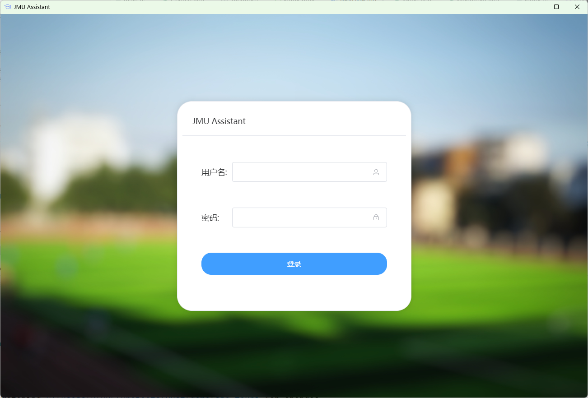
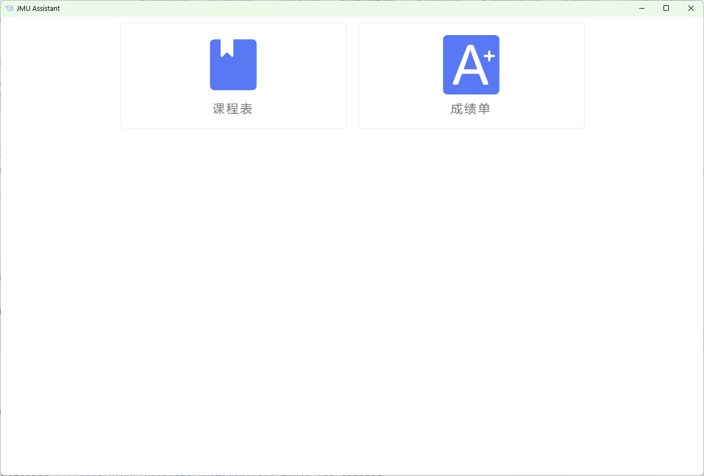
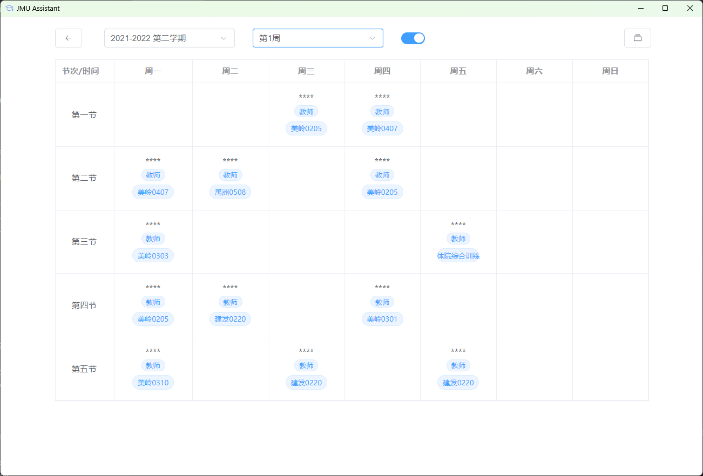

# JMU-Assistant for Desktop
集美大学助手 桌面APP

## 框架
- App主体：[Tauri](https://tauri.app)+[Vite](https://vitejs.dev)+[Vue](https://vuejs.org)+[Typescript](https://www.typescriptlang.org/)
- UI：[Element Plus](https://element-plus.org)
- 登录模块：[Python](https://www.python.org)+[requests](https://github.com/psf/requests)

## 构建
- 环境准备：Rust+Nodejs
- `git clone https://github.com/yuanczx/JMU-Assistant-Desktop.git`
- `cargo install create-tauri-app`
- `cd JMU-Assistant-Desktop && npm install`
- `npm run tauri build`

## 截图

